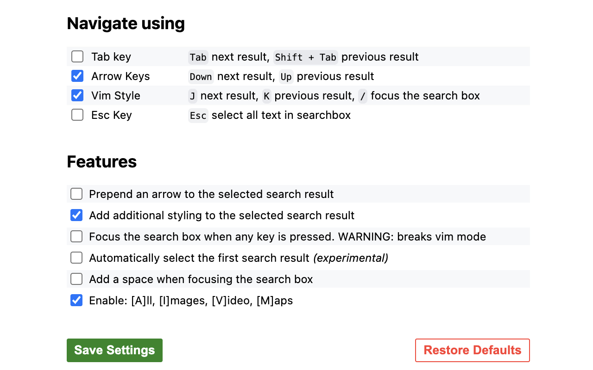

# Google Search Shortcuts

This is my personal copy of an extension that adds navigation shortcuts to the google search page.

## Table of Contents
- [Features](#features)
- [Todo](#todo)
- [Build & Install](#build--install)
- [License & Acknowledgements](#license--acknowledgements)

## Features
- Use `tab` and `shift + tab` to move up and down result links
- Use `up` and `down` to move up and down results
- Vim mode; `j` moves down, `k` moves up and `/` moves focus to search bar
- `esc` selects all text in searchbox
- Add an arrow to show which result is selected
- Add a blue bar on the side of the result
- Automatically select the first search result
- Add a space when focusing the search box
- `a` shows all results, `i` shows images, `v` shows videos, `m` goes to maps

#### Quality of life
- Margin Adjustment: Selected result has padding when near top or bottom of the page

## Todo
- [ ] Create build action
- [ ] Figure out how to create the crx file
- [ ] Automate deploy process
- [ ] Remove "Automatically select the first result on images"
- [ ] Make all results, images, videos work -> find "Filters and topics" element, then closest() images link and click
- [ ] Add ability to focus on tools? And go to year? T-> time -> Y -> year
    - [ ] Add to vim mode, H and L now move the top bar
- [ ] Fix "Add space when selecting search bar" feature
- [ ] Allow extension on images?
- [ ] Allow to rebind j & k
- [ ] Remove install & update notification?
- [ ] Add message notifying user to refresh page when settings are changed

## Build & Install
To use this extension in it's unpacked form you need to:

1. Clone the repository
2. Go to `chrome://extensions/` and click on load unpacked
3. Select the folder of the cloned repository

To build same as above but on chrome extensions click on Pack extension to get the `.crx` build file.

## License & Acknowledgements
All code is under the [GPL v3 license][gpl3].  
Many thanks to Jacob Chafik and the contributors on the [original extension repository][jchafik].  
Also thanks to Valentin Guillet for his [forked repository][Valentin-Guillet] with extended functionality and cleanup.  
And finally thanks to Kuranari for his [forked repository][kuranari].

[gpl3]: https://www.gnu.org/licenses/gpl-3.0.en.html
[jchafik]: https://github.com/jchafik/google-search-shortcuts
[Valentin-Guillet]: https://github.com/Valentin-Guillet/google-search-shortcuts
[kuranari]: https://github.com/kuranari/google-search-shortcuts
